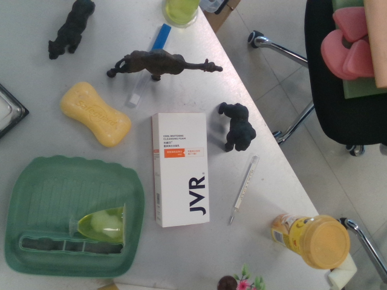
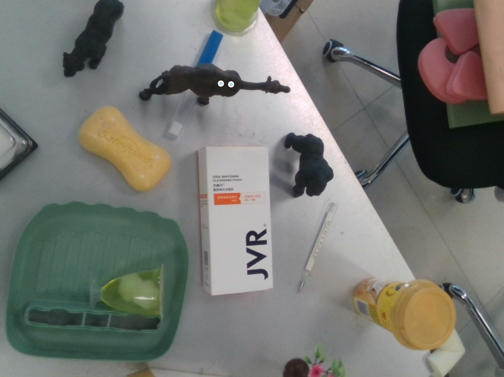
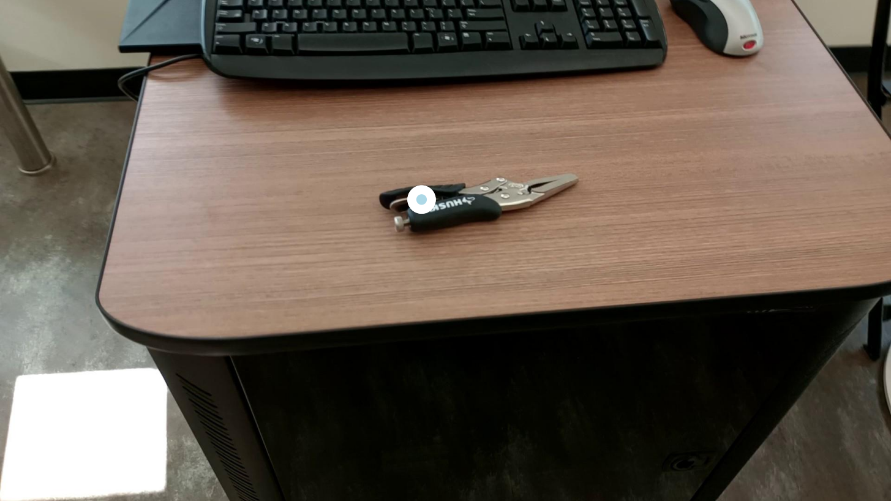

# Embodied-R1: Reinforced Embodied Reasoning for General Robotic Manipulation

<div align="center">

**Embodied-R1: Reinforced Embodied Reasoning for General Robotic Manipulation**

[[🌐 Website](https://embodied-r1.github.io)] [[📄 Paper](http://arxiv.org/abs/2508.13998)] [[🤗 Models](https://huggingface.co/collections/IffYuan/embodied-r1-684a8474b3a49210995f9081)] [[🎯 Datasets](https://huggingface.co/collections/IffYuan/embodied-r1-684a8474b3a49210995f9081)] [[💬 Demo](#demo)]

</div>

---

## 🔥 Updates

- **[2025-08-20]** 🎉 **Models and Datasets Released!** We have released our pre-trained models, training datasets, and comprehensive evaluation benchmarks. Check out our [HuggingFace collection](https://huggingface.co/collections/IffYuan/embodied-r1-684a8474b3a49210995f9081) for all available resources.

- **[Coming Soon]** 📚 Complete training code and detailed training tutorials will be released soon. Stay tuned!

---

## 📖 Overview

**Embodied-R1** is a 3B vision-language model (VLM) designed for general robotic manipulation. Through an innovative **"Pointing"** mechanism and **Reinforced Fine-tuning (RFT)** training methodology, it effectively bridges the "seeing-to-doing" gap in robotics, achieving remarkable zero-shot generalization capabilities.


*Figure 1: Embodied-R1 framework overview, comprehensive performance evaluation, and zero-shot robotic manipulation demonstrations.*

---

## 🛠️ Setup

1.  **Clone the repository**:
    
    ```bash
    git clone https://github.com/pickxiguapi/Embodied-R1.git
    cd Embodied-R1
    ```
    
2.  **Create and activate Conda environment**:
    ```bash
    conda create -n embodied_r1 python=3.11 -y
    conda activate embodied_r1
    ```

3.  **Install dependencies for inference**:
    ```bash
    pip install transformers==4.51.3 accelerate
    pip install qwen-vl-utils[decord]
    ```

3.  **Install dependencies for training (optional)**:
    ```bash
    pip install -r requirements.txt
    ```

---

## 🚀 Inference

**Run the example code:**

~~~python
cd Embodied-R1/
python inference_example.py
~~~

### VTG Example

Task instruction: put the red block on top of the yellow block

**Before prediction (original image):**


**After prediction (visualization result):**


### RRG Example

Task instruction: put pepper in pan

**Before prediction (original image):**


**After prediction (visualization result):**


### REG Example

Task instruction: bring me the camel model

**Before prediction (original image):**



**After prediction (visualization result):**




### OFG Example

Task instruction: loosening stuck bolts

**Before prediction (original image):**


**After prediction (visualization result):**




---

## 📊 Evaluation

```bash
cd eval
python hf_inference_where2place.py
python hf_inference_vabench_point.py
...
```

## 🧠 Training - Coming Soon

We plan to release the complete training code, datasets, and detailed guidelines soon. Stay tuned!

## 📜 Citation

If you use our work in your research, please cite our paper:

```bibtex
@article{yuan2025embodiedr1,
  title={Embodied-R1: Reinforced Embodied Reasoning for General Robotic Manipulation},
  author={Yuan, Yifu and Cui, Haiqin and Huang, Yaoting and Chen, Yibin and Ni, Fei and Dong, Zibin and Li, Pengyi and Zheng, Yan and Hao, Jianye},
  year={2025}
}
```
</div>
